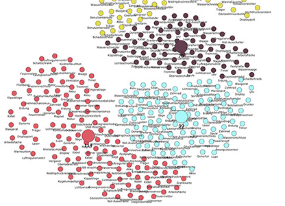

# Data Ocean Framework



## Interactive Clustering with K-Means / K-Modes and Swarm Simulation

[Watch it live!](https://oth-aw.github.io/DataOcean/)

(Best with Chome Browser)

* Zoom in and out with CMD + / - or STRG + / -
* Add Centroids (see menu)

or

Launch `index.html` from a local web server.
e.g.:
```
 python3 -m http.server 8000 
```
Then enter  `(http://0.0.0.0:8000/` in your Browser.

Written in ECMAScript 2015

## Usage

Any data objects in JSON format can be used. Similar objects move towards each other. Objects are similar if they have similar properties. These can be numeric or strings. Properties with an underscore as a prefix are excluded from the similarity comparison (see example `_created`). 

Data objects can be clustered using the interactive K-Means algorithm . The properties to be compared in clustering must have an underscore as a suffix (see example `value_`). 

```javascript
var ocean = new DataOcean('DataOcean').setFullScreen(false);
for (let o in root) {
    ocean.add({label: root[o].name, value_: root[o].quality, _created: root[o].created});
}  
```

Part of project 4 of ISAC@OTH-AW Industry Software Application Center, see documentation about interactive clustering here:

[Development of new types of user concepts for controlling and monitoring digital production](https://github.com/OTH-AW/isac-oth-aw/blob/master/p4/README.md)

[Homepage](https://www.isac-oth.de/) | [Contact](mailto:isac-kontakt@oth-aw.de)


